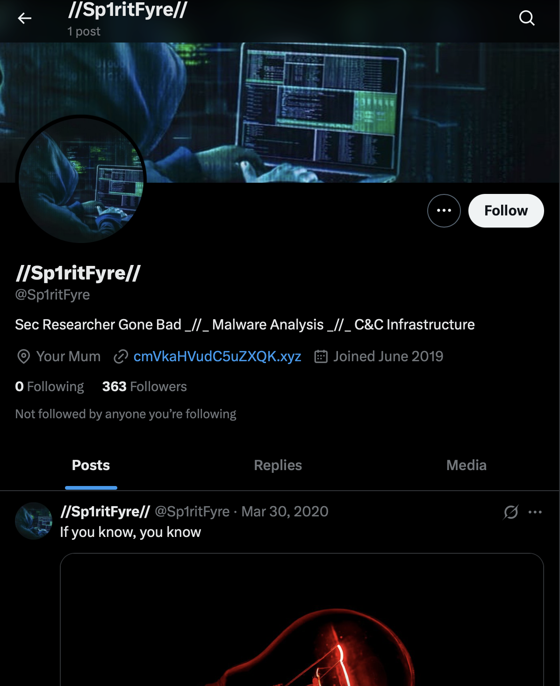
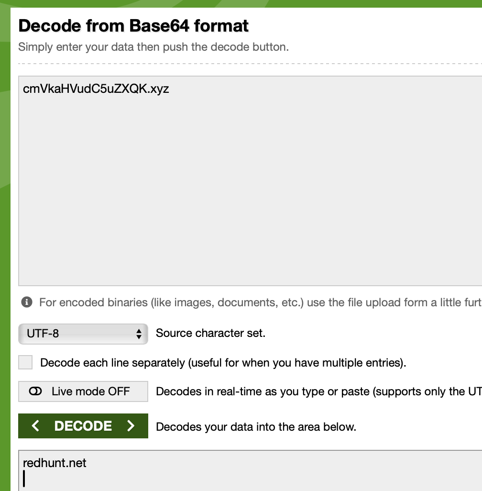
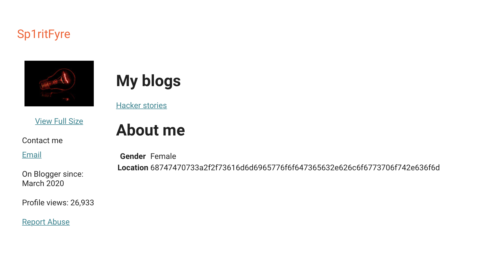
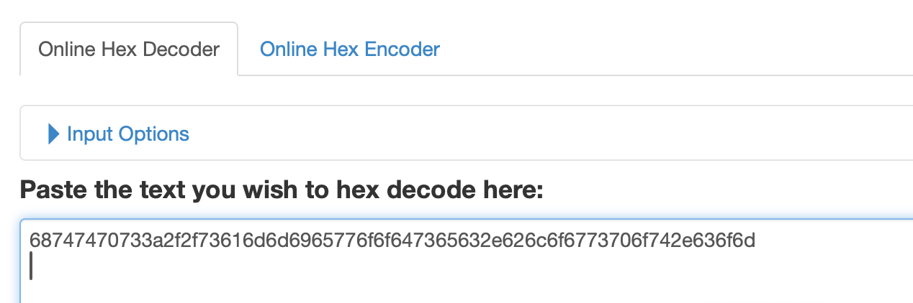
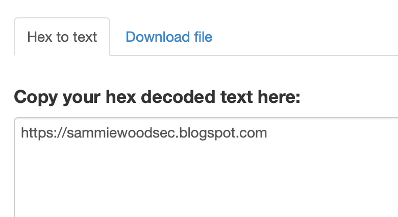
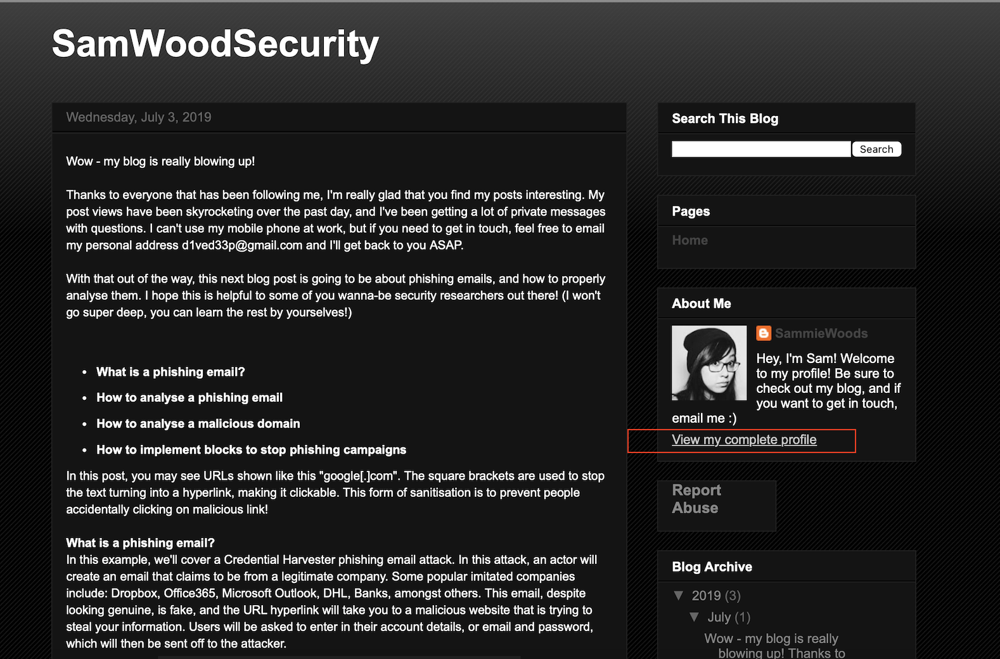

# Open-Source Intelligence (Project Capstone) for Security Blue Team

---

## Overview
> **Goal**  Given the Twitter handle — `@sp1ritfyre` — I have gone through a step-by-step process to get these answers for the following questions:

 1. What is the hacker's first name?
    - Sammie
 3. What is the hacker's last name?
    - Woods
 5. What is the hacker's age?
    - 23
 7. What country does the hacker live in?
    - United Kingdom
 9. What are some of the hacker's interests? (choose 5)
    - Security, Programming, Technology, Gaming, Photography, Camping
 11. What company does the hacker work for?
    - PhilmanSecurityInc
 13. What is the hacker's position within the company?
    - Junior Penetration Tester
 15. What is the full url of the website owned by the hacker?
    - https://redhunt.net
 17. List any full URLs of websites not owned, but used by the hacker (Blogs only)
    - https://sammiewoodsec.blogspot.com
    - https://www.blogger.com/profile/08313689826885886832
 19. What email address has been used by the hacker?
    - d1ved33p@gmail.com

> **Tools used**: Private-mac browser · Google · base64 decoder · hex string decoder.

---

## How I Approached These Step-by-Step:

### 1.  Searched the profile on X
https://twitter.com/sp1ritfyre 
The bio contains the suspicious string: cmVkaHVudC5uZXQK.xyz

---

### 2.  Decoded the Base64 blob
Pasted **`cmVkaHVudC5uZXQK`** into an online Base64 decoder (e.g. <https://base64decode.org>).  
The output is: redhunt.net

---

### 3.  Google-dorked the handle
Google searched: "sp1ritfyre"

The first result shown is **sp1ritfyre.blogspot.com** on the results page. Clicked and got this: 

---

### 4.  Decoded the hex string 
Extracted the long hex value from the blog’s page beside the word location → pasted it into an online Hex-to-Text tool (e.g. <https://www.duplichecker.com/hex-to-text.php>).  
It revealed to be: https://sammiewoodsec.blogspot.com

---

### 5.  Harvested identity details
Clicked the **View my complete profile** page on **sammiewoodsec.blogspot.com** and found the personal data.  

---

### Extracted Identity: 
| Field | Value |
|-------|-------|
| **Name** | Sammie Woods |
| **Age** | 23 |
| **Country** | United Kingdom |
| **Employer** | PhilmanSecurityInc |
| **Position** | Junior Penetration Tester |
| **E-mail** | d1ved33p@gmail.com |
| **Interests** | Security · Photography · Gaming · Malware Analysis · Camping |

---

## Outcome
By putting together a single Base64 decode, one Google dork, and a hex decode, I linked `@sp1ritfyre` → **redhunt.net** → **sammiewoodsec.blogspot.com**, confirming the owner as **Sammie Woods** with complete profile details required for the Managed Service Provider (MSP) breach.

